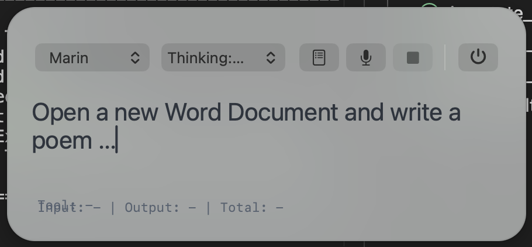

# AIDeskAssistant

`AIDeskAssistant` is a desktop automation assistant built with C# (.NET 8), native macOS integration, and OpenAI tool calling.

The project is designed around a simple loop:

1. Observe the live desktop state.
2. Decide the next concrete action.
3. Act with desktop tools.
4. Re-verify before declaring success.

It can inspect the screen, search visible text, open apps, click, type, move windows, run terminal commands, and work through longer tasks step by step. The codebase contains both macOS and Windows implementations, but active validation and live workflows currently focus on macOS.

## Security Notice

This project is security-critical.

`AIDeskAssistant` can capture screenshots of your desktop and send them to the configured OpenAI service so the model can reason about the current UI. That can expose sensitive information visible on screen, including passwords, emails, chats, internal tools, tokens, documents, and other confidential content.

Use this project only where that risk is acceptable. Do not use it on highly sensitive or regulated screens unless you have reviewed the data flow, trust boundary, retention implications, and compliance impact yourself.

## Current Status

- Primary target: natural-language desktop control on macOS.
- CLI mode and a macOS menu bar app (`AIDesk`) are both available.
- The assistant supports text input, live microphone input, and spoken responses.
- Desktop actions are guarded by explicit validation rules to reduce false-positive success reporting.
- Live regression coverage exists for autonomous calculator and Excel workflows.
- Windows support is present in the codebase but not yet validated to the same level.

## Core Capabilities

- Natural-language multi-step desktop automation.
- Screenshot-based observation of the current UI.
- OCR-based reading and verification of visible screen text.
- Text-targeting with clickable coordinates via `find_text_on_screen`.
- Accessibility-based UI inspection and targeting on macOS.
- Mouse, keyboard, scrolling, and app/window control.
- Terminal command execution for explicit system or file verification.
- Live menu bar interaction with streaming voice input and spoken output.

## macOS Menu Bar Mode

On macOS the project can run as a status bar assistant named `AIDesk`.



This is the main path for hands-free usage:

- text input from the status bar popover
- live microphone capture
- streaming spoken assistant output
- local host process for low-latency tool execution and audio streaming

## Example Commands

```text
Open Excel and write the numbers 1 to 10 into a column.
Continue the Excel sheet to 20 and save it on the desktop as Exceltest AI.
Open Word and write a short project update.
Open TextEdit and insert a short poem.
Open Safari and go to https://example.com.
Move the active window to x 50 y 50 and resize it to 1280 by 800.
Run git status and summarize the changes.
Take a screenshot and tell me what is visible.
```

## Highlights

- Agentic desktop loop with mandatory final validation after state-changing actions.
- Screenshot tooling with optional target highlighting and derived schematic focus views.
- OCR verification and visible-text targeting for labels, spreadsheet cells, and UI copy.
- Accessibility-first macOS tooling for menus, sidebars, frontmost content, and UI elements.
- Focused debug and regression flows for autonomous desktop tasks.

## Requirements

| Platform | Runtime | Status |
|----------|---------|--------|
| macOS | .NET 8+ | tested and actively developed |
| Windows | .NET 8+ | implementation present, currently untested |

## Getting Started

### 1. Clone and build

```bash
git clone https://github.com/ronnycsharp/AIDeskAssistant.git
cd AIDeskAssistant
dotnet build AIDeskAssistant.sln
```

### 2. Configure OpenAI credentials

You can provide the API key through environment variables or a local `.env` file.

macOS or Linux:

```bash
export OPENAI_API_KEY="sk-..."
```

Windows PowerShell:

```powershell
$env:OPENAI_API_KEY = "sk-..."
```

Local `.env` example:

```dotenv
OPENAI_API_KEY=sk-...
OPENAI_MODEL=gpt-5-mini
AIDESK_MAX_TOOL_ROUNDS=120
```

The local `.env` file is ignored by git.

### 3. Run the CLI

```bash
dotnet run --project src/AIDeskAssistant
```

### 4. Run the macOS menu bar app

```bash
dotnet run --project src/AIDeskAssistant -- --menu-bar
```

Companion commands:

```bash
dotnet run --project src/AIDeskAssistant -- --menu-bar-status
dotnet run --project src/AIDeskAssistant -- --menu-bar-stop
```

macOS note:

- The menu bar helper is currently launched as a Swift script through `xcrun swift`.
- The target machine therefore needs Apple developer tools available, typically Xcode Command Line Tools.
- A packaged distribution would need the helper bundled as a prebuilt binary or moved to a different hosting model.

### 5. Optional debug logging

```bash
dotnet run --project src/AIDeskAssistant -- --debug-model-io
```

This creates a local session folder under `.aidesk-debug/` with tool traces, screenshots, and assistant responses.

## CLI Commands

| Command | Description |
|---------|-------------|
| `/help` | Show help text |
| `/clear`, `/reset` | Clear conversation history |
| `/quit`, `/exit` | Exit the program |
| `Ctrl+C` | Cancel the current AI request |

## Environment Variables

| Variable | Default | Description |
|----------|---------|-------------|
| `OPENAI_API_KEY` | required | OpenAI API key |
| `OPENAI_MODEL` | `gpt-5-mini` | Chat model used by CLI mode |
| `OPENAI_REALTIME_MODEL` | `gpt-realtime` | Realtime model used by the macOS menu bar mode |
| `AIDESK_MAX_TOOL_ROUNDS` | `60` | Maximum tool rounds before the assistant stops |
| `AIDESK_DEBUG_MODEL_IO` | unset | Enable local debug logging for model input, screenshots, and tool traces |
| `AIDESK_DEBUG_DIR` | `.aidesk-debug` | Base directory for debug sessions |
| `AIDESK_MENU_BAR_STATUS_FILE` | temp dir | Tracks the running menu bar host |
| `AIDESK_SCREENSHOT_MAX_DIMENSION` | `1280` | Maximum image dimension for screenshots sent to the model |
| `AIDESK_SCREENSHOT_JPEG_QUALITY` | `60` | JPEG quality for optimized screenshots |
| `AIDESK_REALTIME_VOICE` | `alloy` | Voice used for spoken output |
| `AIDESK_REALTIME_SAMPLE_RATE` | `24000` | Sample rate for menu bar voice recording |
| `AIDESK_MENU_BAR_SELF_TEST_TEXT` | unset | Optional automatic self-test prompt for the menu bar helper |
| `AIDESK_MENU_BAR_LOG_FILE` | unset | Optional log file for Swift menu bar diagnostics |
| `AIDESK_MENU_BAR_SILENCE_COMMIT_SECONDS` | `0.9` | Silence duration before auto-commit of live microphone input |
| `AIDESK_MENU_BAR_SILENCE_THRESHOLD` | `0.015` | Peak threshold for speech detection |
| `AIDESK_MENU_BAR_RMS_THRESHOLD` | `0.003` | Minimum RMS threshold for speech detection |
| `AIDESK_MENU_BAR_MIN_SPEECH_SECONDS` | `0.25` | Minimum speech duration before silence can auto-commit |
| `AIDESK_MENU_BAR_RMS_CALIBRATION_SECONDS` | `0.35` | Initial calibration period for background RMS |
| `AIDESK_MENU_BAR_NOISE_FLOOR_MULTIPLIER` | `2.5` | Adaptive multiplier for speech threshold calculation |
| `AIDESK_MENU_BAR_NOISE_FLOOR_PADDING` | `0.002` | Additional safety margin for adaptive speech threshold |

## Available Desktop Tools

The model can call tools such as:

- `take_screenshot`
- `read_screen_text`
- `find_text_on_screen`
- `get_frontmost_ui_elements`
- `find_ui_element`
- `click_ui_element`
- `get_cursor_position`
- `move_mouse`
- `click`
- `double_click`
- `scroll`
- `type_text`
- `press_key`
- `open_application`
- `focus_application`
- `open_url`
- `run_command`
- `click_dock_application`
- `click_apple_menu_item`
- `click_system_settings_sidebar_item`
- `focus_frontmost_window_content`
- `get_active_window_bounds`
- `move_active_window`
- `resize_active_window`
- `wait`

## Testing

Run the full suite:

```bash
dotnet test AIDeskAssistant.sln
```

The repository also contains opt-in live desktop regressions. These are intentionally disabled by default because they drive real applications on the current machine.

Examples:

```bash
AIDESK_ENABLE_LIVE_CALCULATOR_LLM_REGRESSION_TESTS=1 dotnet test tests/AIDeskAssistant.Tests/AIDeskAssistant.Tests.csproj --filter "CalculatorNaturalLanguageLiveRegressionTests"
AIDESK_ENABLE_LIVE_EXCEL_LLM_REGRESSION_TESTS=1 dotnet test tests/AIDeskAssistant.Tests/AIDeskAssistant.Tests.csproj --filter "ExcelNaturalLanguageLiveRegressionTests"
```

The live regression flows can capture tool traces, screenshots, highlighted prepared views, OCR outputs, and final verification artifacts under `tests/AIDeskAssistant.Tests/bin/Debug/net8.0/TestResults/`.

## Project Structure

```text
src/
  AIDeskAssistant/
    Program.cs
    PlatformServiceFactory.cs
    Models/
    Platform/
    Services/
    Tools/
tests/
  AIDeskAssistant.Tests/
```

## macOS Permissions

On macOS you must grant the required permissions to the host application you run the assistant from.

- Accessibility
- Screen Recording
- Microphone for menu bar voice mode

You can find them in `System Settings -> Privacy & Security`.

## Notes

- `.env` is ignored and should stay local.
- `.aidesk-debug/` is ignored and should stay local.
- The repository is still evolving; prompts, tools, APIs, and workflow guardrails may change.

## License

This project is licensed under the MIT License. See `LICENSE`.
